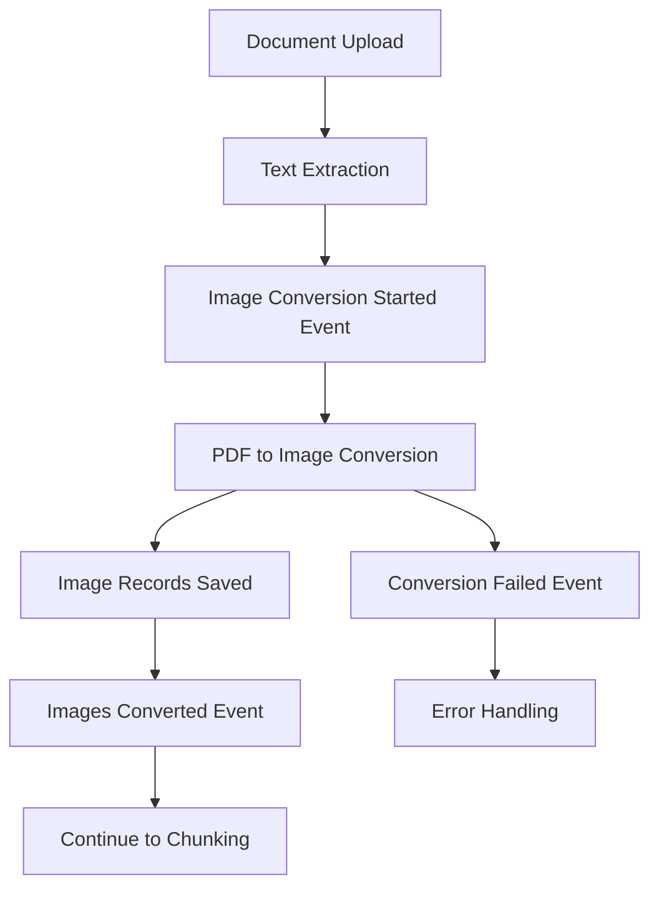

# PDF-to-Image Conversion Inngest Workflow Implementation

## Overview

This document describes the complete implementation of a PDF-to-image conversion workflow using Inngest for the RAG Chat Application. The workflow automatically converts PDF pages to images after text extraction, enabling visual document processing and enhanced RAG capabilities.

## Architecture Components

### 1. Database Schema Extensions

**New Table: `DocumentImage`**
- Stores metadata for converted images
- Links to parent documents via `documentId` foreign key
- Tracks page numbers, file paths, dimensions, and conversion metadata
- Includes indexes for efficient querying

**Location**: `/lib/db/schema.ts`

```sql
CREATE TABLE "DocumentImage" (
  id UUID PRIMARY KEY DEFAULT gen_random_uuid(),
  documentId UUID NOT NULL REFERENCES "RAGDocument"(id) ON DELETE CASCADE,
  pageNumber INTEGER NOT NULL,
  imagePath TEXT NOT NULL,
  format TEXT NOT NULL DEFAULT 'png',
  width INTEGER,
  height INTEGER,
  fileSize TEXT,
  quality INTEGER,
  metadata JSON,
  createdAt TIMESTAMP NOT NULL DEFAULT NOW(),
  UNIQUE(documentId, pageNumber)
);
```

### 2. Event System Extensions

**New Events Added to EventSchemas**:
- `document.image-conversion-started` - Triggered when PDF-to-image conversion begins
- `document.images-converted` - Emitted when conversion completes successfully
- `document.image-conversion-failed` - Emitted when conversion fails

**Location**: `/lib/inngest/events.ts`, `/lib/inngest/client.ts`

### 3. Core Conversion Library

**PDF-to-Image Converter** (`/lib/document-processing/pdf-to-image-converter.ts`)

Key features:
- Security validation for file paths
- Support for multiple output formats (PNG, JPEG, WebP)
- Configurable quality and density settings
- Page-by-page conversion with error handling
- Comprehensive metadata collection
- File system cleanup utilities

**Key Functions**:
- `convertPdfToImages()` - Main conversion function
- `convertSinglePage()` - Single page conversion
- `validateConfig()` - Configuration validation
- `cleanupDocumentImages()` - File cleanup

### 4. Inngest Workflow Implementation

**Main Workflow** (`/lib/workflows/pdf-to-image-conversion.ts`)

The workflow implements a robust processing pipeline:

1. **Document Validation** - Verifies document exists and is ready for conversion
2. **Configuration Setup** - Establishes conversion parameters
3. **Image Conversion** - Processes PDF pages to images
4. **Database Storage** - Saves image metadata to database
5. **Event Emission** - Triggers downstream processing
6. **Error Handling** - Manages failures and retries

**Status Integration**: Updates DocumentStatusManager with `image_conversion` step

### 5. Inngest Function Registration

**Function Definition** (`/lib/inngest/functions/convert-pdf-to-images.ts`)

Configured with:
- Concurrency limits (3 concurrent conversions)
- Rate limiting (10 conversions per minute)
- Timeout handling (10 minutes for large PDFs)
- Retry logic (3 attempts)

**Trigger**: `document.text-extracted` event

### 6. Image Management Utilities

**Image Manager** (`/lib/document-processing/image-manager.ts`)

Provides comprehensive image management:
- Retrieval functions for document images
- Statistics and analytics
- File verification and integrity checking
- Cleanup and maintenance operations
- Metadata management

**Key Functions**:
- `getDocumentImages()` - Retrieve all images for a document
- `getDocumentImageStats()` - Calculate image statistics
- `verifyDocumentImageFiles()` - Check file integrity
- `cleanupDocumentImages()` - Remove images and records

### 7. Processing Pipeline Integration

**Status Manager Updates** (`/lib/document-processing/status-manager.ts`)

Added `image_conversion` step to the standard processing pipeline:
```
text_extraction → image_conversion → chunking → embedding → indexing
```

Status progression logic updated to handle the new step appropriately.

## Workflow Integration Points

### Event Flow



### Trigger Configuration

The workflow is triggered by the `document.text-extracted` event, ensuring:
- Text extraction has completed successfully
- Document is in the correct state for image processing
- Downstream processes have access to both text and image data

### Error Handling Strategy

1. **Validation Errors**: Invalid file paths, unsupported formats
2. **File System Errors**: Missing files, permission issues
3. **Conversion Errors**: PDF parsing failures, memory issues
4. **Database Errors**: Connection issues, constraint violations

Each error type is handled with appropriate logging and event emission.

## Configuration Options

### Conversion Settings

```typescript
interface ConversionConfig {
  format?: 'png' | 'jpg' | 'jpeg' | 'webp';
  quality?: number; // 1-100 for JPEG/WebP compression
  density?: number; // DPI for conversion (default: 150)
  width?: number; // Output width in pixels
  height?: number; // Output height in pixels
  preserveAspectRatio?: boolean;
  outputDir?: string; // Directory to save images
}
```

### Default Configuration

- **Format**: PNG (lossless, good for text documents)
- **Quality**: 85 (good balance for compressed formats)
- **Density**: 150 DPI (suitable for screen viewing)
- **Output Directory**: `/uploads/images/{documentId}/`

## Testing Implementation

**Test Suite** (`/tests/lib/pdf-to-image-conversion.test.ts`)

Comprehensive test coverage including:

1. **Unit Tests**:
   - Configuration validation
   - Security path checking
   - Error handling scenarios

2. **Integration Tests**:
   - Complete workflow execution
   - Database operations
   - Event emission

3. **Manager Tests**:
   - Image retrieval and statistics
   - File verification
   - Cleanup operations

## Deployment Considerations

### Environment Variables

No new environment variables required. Uses existing Inngest configuration:
- `INNGEST_EVENT_KEY`
- `INNGEST_SIGNING_KEY`

### File System Requirements

- Write access to `/uploads/images/` directory
- Sufficient disk space for image storage
- Regular cleanup of old/orphaned images

### Dependencies

Additional package required: `pdf2pic`
```bash
npm install pdf2pic
```

### Resource Requirements

- Memory: ~100MB per concurrent conversion
- CPU: High usage during conversion
- Disk: ~500KB-2MB per page (depending on settings)

### Monitoring and Observability

Built-in monitoring through:
- Inngest dashboard for workflow visibility
- Document status tracking
- Error event emission
- File verification utilities

## API Integration

### Getting Document Images

```typescript
import { getDocumentImages } from '@/lib/document-processing/image-manager';

const images = await getDocumentImages(documentId);
```

### Checking Image Availability

```typescript
import { documentHasImages } from '@/lib/document-processing/image-manager';

const hasImages = await documentHasImages(documentId);
```

### Manual Conversion Trigger

```typescript
import { triggerImageConversionForDocument } from '@/lib/workflows/pdf-to-image-conversion';

await triggerImageConversionForDocument(documentId, userId);
```

## Future Enhancements

### Potential Improvements

1. **OCR Integration**: Add text recognition for images
2. **Image Analysis**: Extract visual features for enhanced search
3. **Format Optimization**: Dynamic format selection based on content
4. **Thumbnail Generation**: Create preview thumbnails
5. **Batch Processing**: Process multiple documents simultaneously
6. **Cloud Storage**: Integration with S3/GCS for image storage

### Performance Optimizations

1. **Parallel Page Processing**: Convert pages concurrently
2. **Streaming Output**: Process pages as they're converted
3. **Caching**: Cache frequently accessed images
4. **Compression**: Smart compression based on content type

## Migration Guide

### Database Migration

Run database migration to add the `DocumentImage` table:
```bash
bun run db:generate
bun run db:migrate
```

### Function Registration

The function is automatically registered via the updated handler configuration.

### Existing Document Processing

For existing documents, trigger manual conversion:
```typescript
// Process all text-extracted documents
const documents = await db.select()
  .from(ragDocument)
  .where(eq(ragDocument.status, 'text_extracted'));

for (const doc of documents) {
  await triggerImageConversionForDocument(doc.id, doc.uploadedBy);
}
```

## Security Considerations

### Path Validation

- All file paths are validated against security patterns
- No directory traversal attacks possible
- Restricted to `/uploads/` directory tree

### File Type Validation

- Only PDF files are processed
- MIME type validation enforced
- File extension checking

### Access Control

- User-based access through existing authentication
- Document ownership validation
- API rate limiting applied

## Conclusion

This implementation provides a robust, scalable PDF-to-image conversion workflow that integrates seamlessly with the existing RAG application architecture. The design emphasizes security, reliability, and maintainability while providing comprehensive error handling and monitoring capabilities.

The workflow enables enhanced document processing capabilities, setting the foundation for advanced visual RAG features and improved user experience.