# 🏗️ Multimodal RAG System Architecture

*Comprehensive architectural documentation for the production-ready multimodal document processing and retrieval system*

## 📋 Table of Contents

1. [System Overview](#system-overview)
2. [High-Level Architecture](#high-level-architecture)
3. [Component Architecture](#component-architecture)
4. [Data Flow Diagrams](#data-flow-diagrams)
5. [API Integration Points](#api-integration-points)
6. [Security Architecture](#security-architecture)
7. [Scalability & Performance](#scalability--performance)
8. [Deployment Architecture](#deployment-architecture)
9. [Extension Points](#extension-points)
10. [ADE Visualize Integration](#ade-visualize-integration)

---

## System Overview

### Core Capabilities

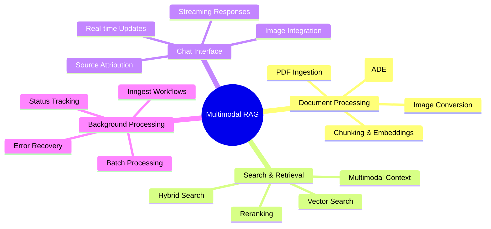

### Technology Stack

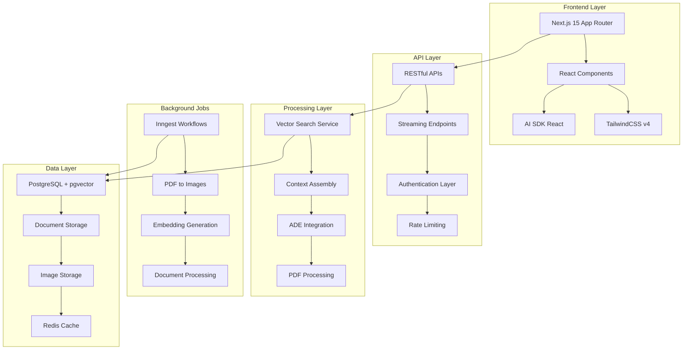

---

## High-Level Architecture

### System Components

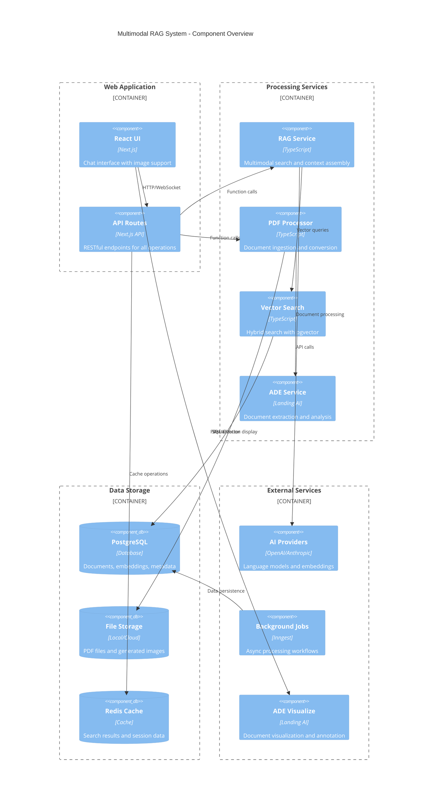

### Service Boundaries

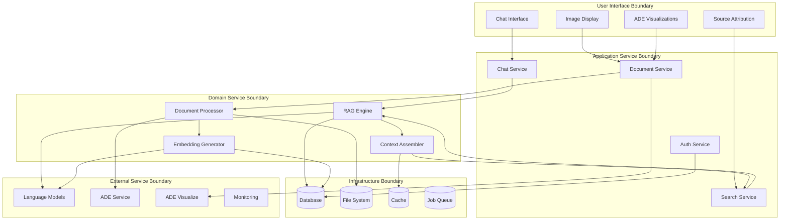

---

## Component Architecture

### Document Processing Pipeline with ADE Integration

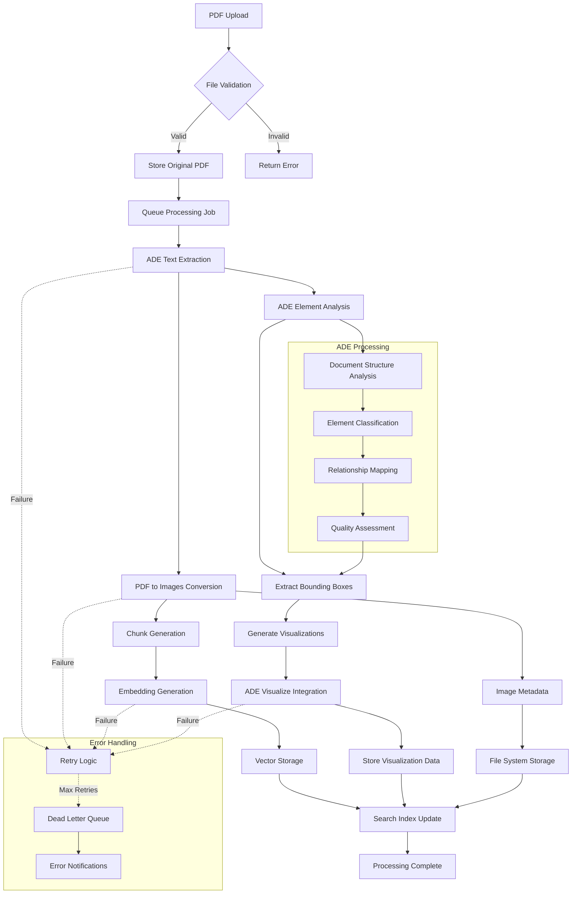

### Enhanced Vector Search with ADE Metadata

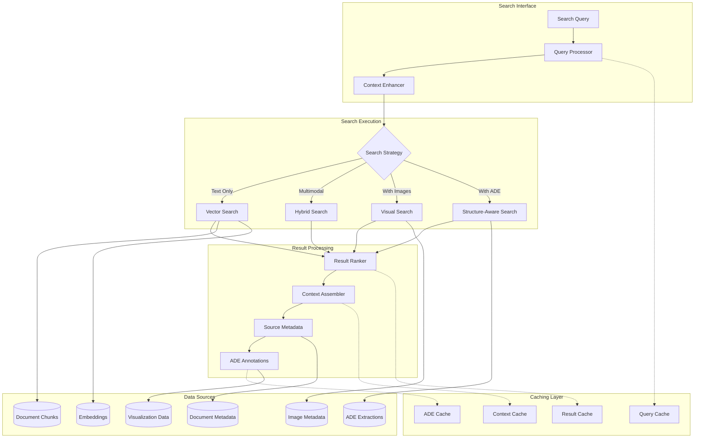

### Multimodal Context Assembly with ADE Visualize

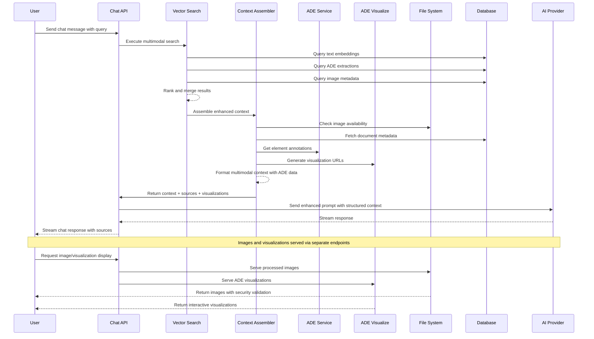

---

## ADE Visualize Integration

### ADE Visualize Architecture

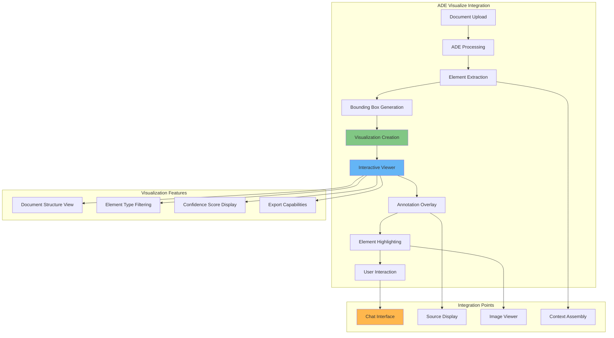

### ADE Visualize Component Integration

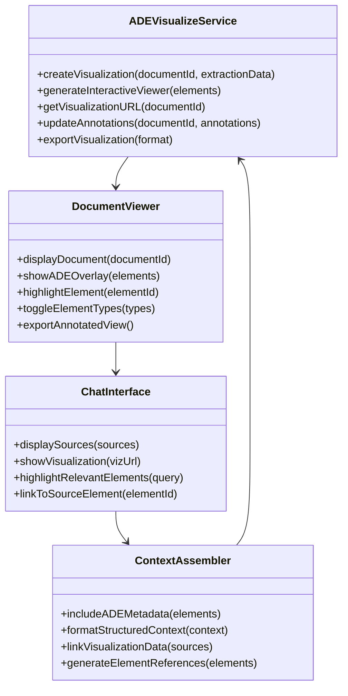

### ADE Visualize Data Flow

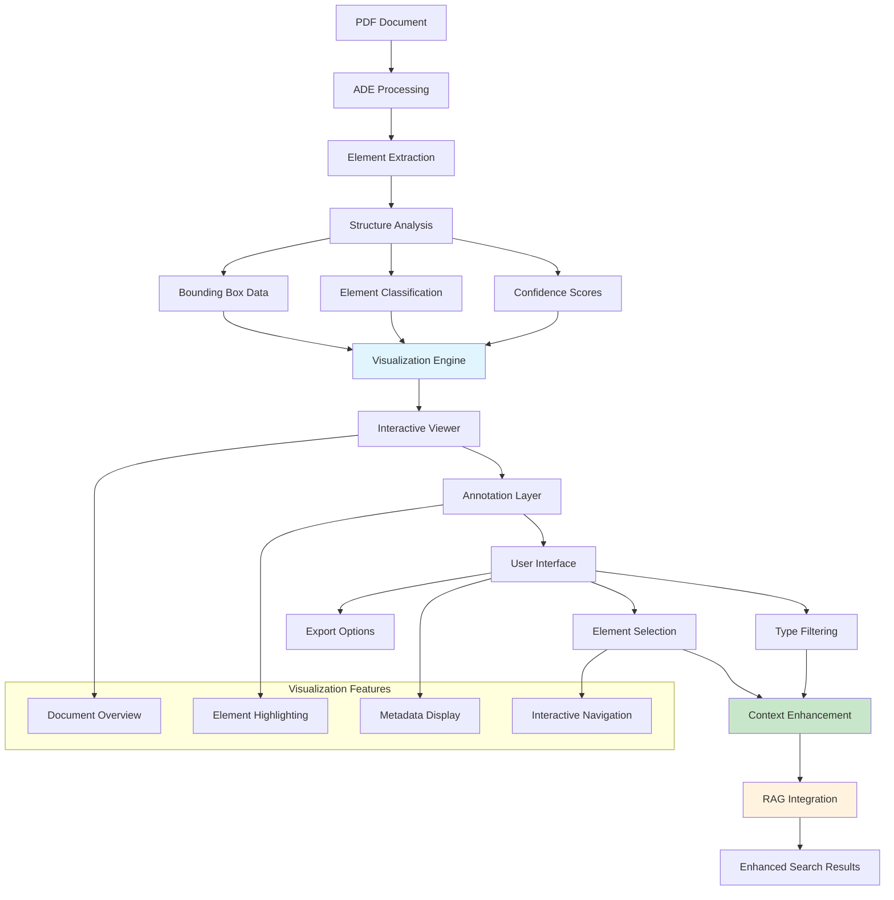

### Enhanced Source Metadata with ADE Visualize

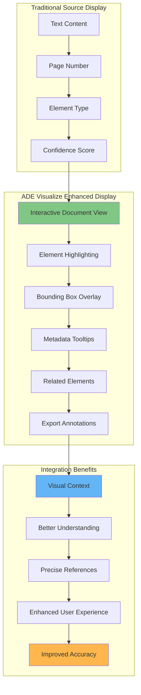

---

## Data Flow Diagrams

### Document Ingestion Flow with ADE Visualize

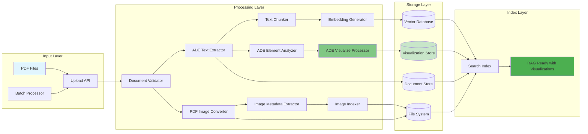

### Enhanced Search and Retrieval Flow

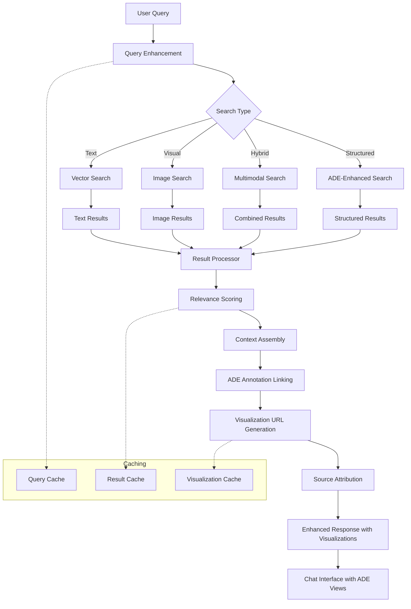

---

## API Integration Points

### Enhanced API Endpoints with ADE Visualize

```mermaid
graph TB
    subgraph "Chat APIs"
        A[POST /api/chat] --> A1[Standard chat with RAG]
        B[POST /api/chat/rag] --> B1[Enhanced multimodal chat with ADE]
        C[GET /api/chat/rag] --> C1[RAG capabilities & ADE stats]
    end
    
    subgraph "Document APIs"
        D[POST /api/documents/upload] --> D1[PDF file upload with ADE processing]
        E[POST /api/documents/process] --> E1[Process with ADE extraction]
        F[GET /api/documents/list] --> F1[List with ADE metadata]
        G[GET /api/documents/:id] --> G1[Document details with visualizations]
        H[GET /api/documents/:id/visualize] --> H1[ADE visualization data]
    end
    
    subgraph "Search APIs"
        I[POST /api/search] --> I1[Vector search with ADE filtering]
        J[GET /api/search/stats] --> J1[Search analytics with ADE metrics]
    end
    
    subgraph "Image & Visualization APIs"
        K[GET /api/images/[...path]] --> K1[Secure image serving]
        L[GET /api/visualizations/[...path]] --> L1[ADE visualization serving]
        M[POST /api/visualizations/export] --> M1[Export ADE annotations]
    end
    
    subgraph "Background Jobs"
        N[POST /api/inngest] --> N1[Webhook endpoint with ADE events]
        O[GET /api/health] --> O1[System health with ADE status]
    end
    
    style A fill:#81c784
    style B fill:#81c784
    style H fill:#64b5f6
    style L fill:#f06292
    style M fill:#ffb74d
```

### ADE Visualize API Contracts

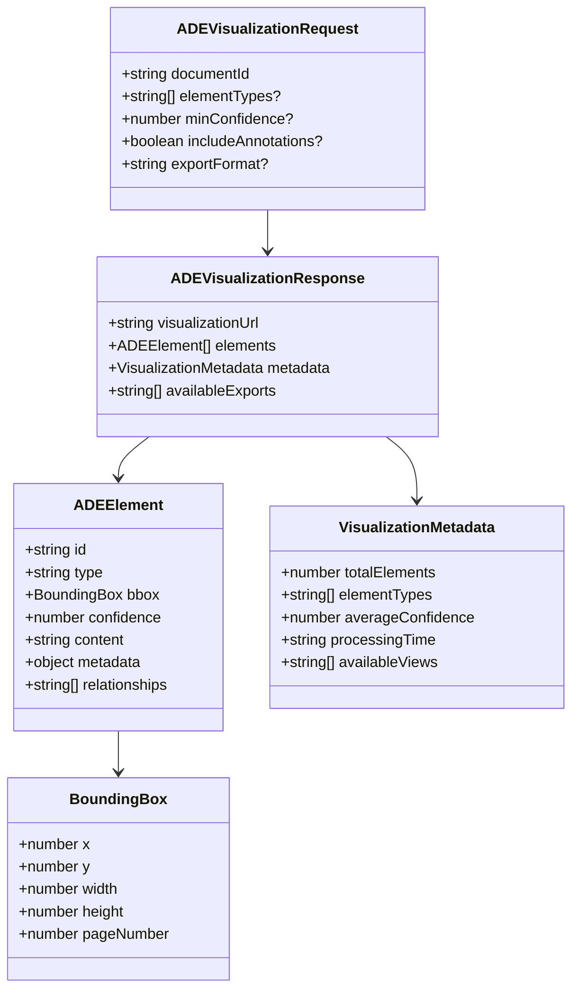

---

## Security Architecture

### Security Layers with ADE Integration

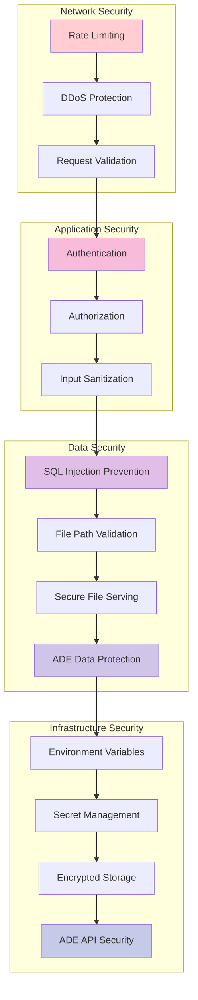

---

## TypeScript Agentic Document Implementation

### Agentic Document Processing - Landing AI Inspired

We've implemented a comprehensive TypeScript equivalent of Landing AI's agentic-doc Python library, providing advanced document understanding capabilities:

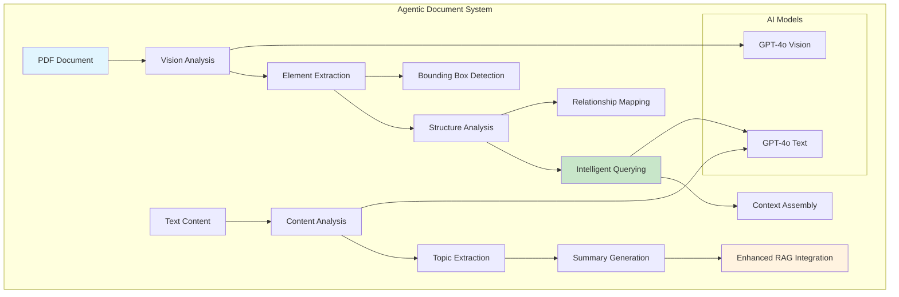

### Core Components

```typescript
// Agentic Document Processor
interface DocumentElement {
  id: string;
  type: 'text' | 'table' | 'figure' | 'header' | 'footer' | 'list' | 'paragraph' | 'title';
  content: string;
  boundingBox: {
    x: number; y: number; width: number; height: number; pageNumber: number;
  };
  confidence: number;
  metadata?: Record<string, any>;
  relationships?: string[];
}

interface DocumentAnalysis {
  documentId: string;
  title?: string;
  totalPages: number;
  elements: DocumentElement[];
  structure: {
    hasTable: boolean;
    hasFigures: boolean;
    hasHeaders: boolean;
    sectionCount: number;
  };
  summary: string;
  keyTopics: string[];
  metadata?: Record<string, any>;
}

class AgenticDocProcessor {
  async analyzeDocument(
    documentPath: string,
    imagePaths: string[],
    options: DocumentProcessingOptions
  ): Promise<DocumentAnalysis>;
  
  async queryDocument(
    analysis: DocumentAnalysis,
    query: string,
    includeVisualContext: boolean
  ): Promise<{
    answer: string;
    relevantElements: DocumentElement[];
    confidence: number;
  }>;
  
  async exportAnalysis(
    analysis: DocumentAnalysis,
    format: 'json' | 'markdown' | 'csv',
    outputPath: string
  ): Promise<void>;
}
```

### Integration with RAG System

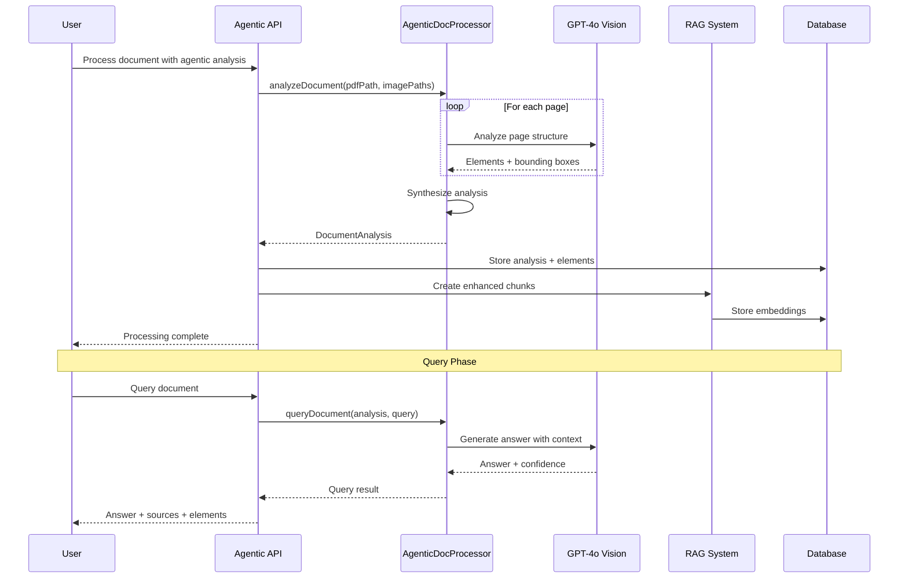

### API Endpoints

```typescript
// POST /api/documents/agentic
// Process document with agentic analysis
{
  "documentId": "string",
  "options": {
    "generateEmbeddings": true,
    "chunkSize": 1000,
    "overlapSize": 200,
    "confidenceThreshold": 0.7,
    "enableStructuralAnalysis": true
  }
}

// GET /api/documents/agentic?action=query
// Query document with agentic insights
// ?documentId=string&query=string&includeVisualContext=boolean

// GET /api/documents/agentic?action=summary
// Get enhanced document summary
// ?documentId=string
```

### React Component Integration

```typescript
// AgenticDocumentViewer Component Features:
// - Document processing with progress tracking
// - Interactive element visualization
// - Intelligent document querying
// - Confidence scoring and source attribution
// - Export capabilities in multiple formats
// - Real-time analysis updates

interface AgenticDocumentViewerProps {
  documentId: string;
  documentTitle: string;
  onQueryResult?: (result: any) => void;
}

// Usage in chat interface:
<AgenticDocumentViewer 
  documentId={document.id}
  documentTitle={document.title}
  onQueryResult={(result) => {
    // Integrate query results with chat context
    updateChatContext(result);
  }}
/>
```

### Advanced Features

1. **Visual Element Detection**: AI-powered identification of tables, figures, headers, and text blocks with precise bounding boxes

2. **Structural Analysis**: Understanding document hierarchy, sections, and relationships between elements

3. **Intelligent Querying**: Context-aware question answering using both text and visual elements

4. **Confidence Scoring**: Each element extraction includes confidence scores for quality assessment

5. **Multi-format Export**: JSON, Markdown, and CSV export formats for analysis results

6. **RAG Integration**: Enhanced chunks created from high-confidence elements with metadata

7. **Progressive Processing**: Real-time progress tracking and incremental updates

### Implementation Timeline - COMPLETED ✅

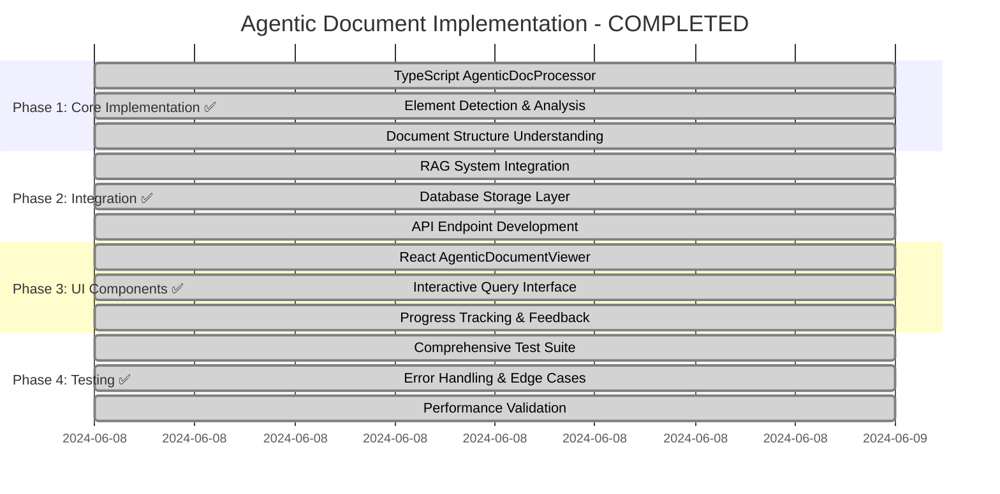

---

## 📐 Architecture Principles

### Design Principles

1. **Modularity**: Clear separation of concerns with well-defined interfaces
2. **Scalability**: Horizontal scaling capabilities at every layer
3. **Security**: Defense in depth with multiple security layers
4. **Performance**: Caching and optimization at every level
5. **Extensibility**: Plugin architecture for easy enhancements
6. **Maintainability**: Clear code organization and documentation
7. **Observability**: Comprehensive logging, metrics, and tracing
8. **Resilience**: Error handling and recovery mechanisms
9. **Visual Intelligence**: ADE integration for enhanced document understanding
10. **User Experience**: Interactive visualizations for better comprehension

### Technology Decisions

- **Next.js 15**: Modern React framework with app router
- **TypeScript**: Type safety and developer experience
- **PostgreSQL + pgvector**: Reliable database with vector search
- **Inngest**: Reliable background job processing
- **Drizzle ORM**: Type-safe database operations
- **AI SDK**: Unified interface for AI providers
- **Better Auth**: Secure authentication system
- **ADE Visualize**: Advanced document visualization and interaction
- **Landing AI ADE**: Professional document extraction and analysis

This architecture provides a solid foundation for a production-ready multimodal RAG system with advanced document visualization capabilities, clear paths for scaling, extending, and maintaining the application as it grows.