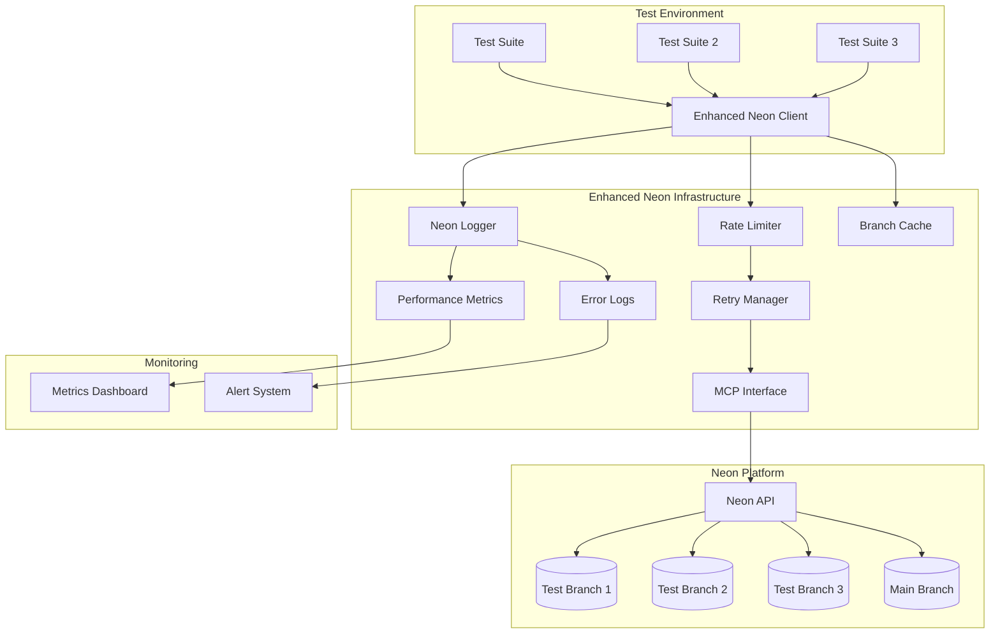
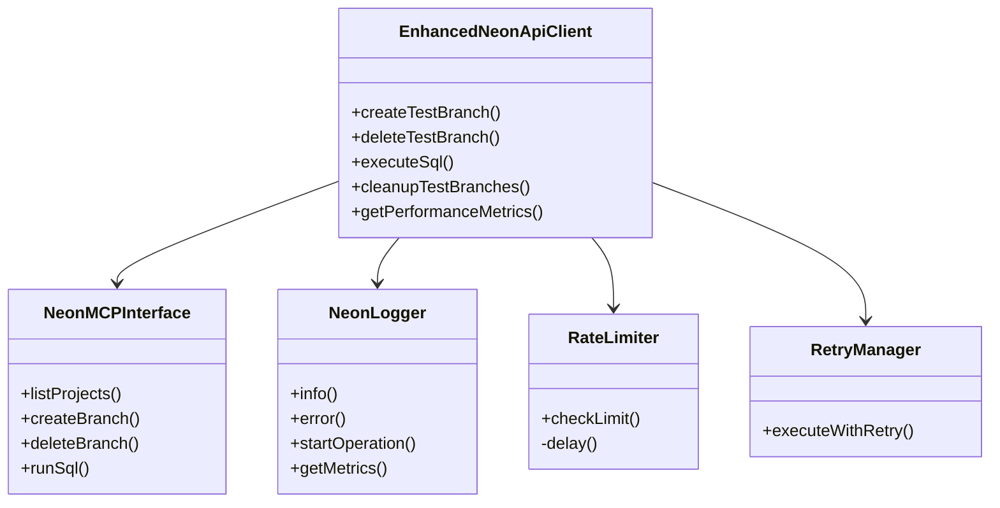

# Enhanced Neon Testing Infrastructure - Master Documentation

## Table of Contents

1. [Overview](#overview)
2. [Architecture](#architecture)
3. [Getting Started](#getting-started)
4. [Core Components](#core-components)
5. [Usage Examples](#usage-examples)
6. [Best Practices](#best-practices)
7. [Performance Optimization](#performance-optimization)
8. [Troubleshooting](#troubleshooting)
9. [API Reference](#api-reference)
10. [Related Documentation](#related-documentation)

## Overview

The Enhanced Neon Testing Infrastructure provides a production-ready solution for managing isolated database environments in testing workflows. Built on top of Neon's database branching capabilities, this infrastructure offers:

### Key Features

- **🔄 Automated Branch Management**: Create and destroy isolated test databases automatically
- **⚡ Performance Optimized**: Rate limiting, connection pooling, and intelligent retry logic
- **📊 Comprehensive Monitoring**: Built-in logging, metrics, and performance tracking
- **🛡️ Production Ready**: Error handling, safety checks, and graceful degradation
- **🔧 Developer Friendly**: TypeScript support, intuitive APIs, and helpful utilities
- **🌐 CI/CD Integrated**: Designed for automated testing pipelines

### Benefits

1. **Test Isolation**: Each test suite runs in its own database branch
2. **Parallel Testing**: Run multiple test suites concurrently without conflicts
3. **Cost Efficient**: Automatic cleanup prevents resource waste
4. **Reliable**: Built-in retry logic and error recovery
5. **Observable**: Detailed logging and performance metrics

## Architecture

### System Architecture Diagram



### Component Relationships



## Getting Started

### Prerequisites

- Node.js 18+ or Bun runtime
- Neon account with API access
- PostgreSQL client library (pg, postgres, or drizzle)

### Step 1: Environment Setup

Create a `.env.test` file in your project root:

```bash
# Required
NEON_PROJECT_ID=your-project-id

# Optional Configuration
NEON_DATABASE_NAME=neondb
NEON_ROLE_NAME=neondb_owner
NEON_USE_POOLING=true

# Performance Settings
NEON_BRANCH_TIMEOUT=120000
NEON_DEFAULT_BRANCH_TAGS=automated,test
ENABLE_BRANCH_METRICS=true

# Cleanup Settings
NEON_PRESERVE_TAGGED_BRANCHES=true
NEON_PRESERVE_TAGS=preserve,keep
NEON_BRANCH_NAME_PREFIX=test-
```

### Step 2: Install Dependencies

```bash
# Using Bun
bun add pg dotenv

# Using npm
npm install pg dotenv
```

### Step 3: Basic Setup

```typescript
// tests/setup.ts
import { config } from 'dotenv';
import { setupNeonTestBranching } from './config/neon-branch-setup';

// Load test environment
config({ path: '.env.test' });

// Setup for a test suite
setupNeonTestBranching('my-test-suite', {
  useEnhancedClient: true,
  enableMetrics: true
});
```

### Step 4: Run Your First Test

```typescript
import { describe, it } from 'vitest';
import { getNeonApiClient } from '@/lib/testing/neon-api-client';

describe('My First Neon Test', () => {
  it('should create and use a test branch', async () => {
    const client = getNeonApiClient();
    
    await client.withTestBranch(
      {
        testSuite: 'first-test',
        purpose: 'learning',
        tags: ['tutorial']
      },
      async (branchInfo) => {
        console.log('Connected to:', branchInfo.connectionString);
        // Your test code here
        return { success: true };
      }
    );
  });
});
```

## Core Components

### 1. Enhanced Neon API Client

The main interface for all Neon operations:

```typescript
import { EnhancedNeonApiClient, getNeonApiClient } from '@/lib/testing/neon-api-client';

const client = getNeonApiClient({
  defaultProjectId: 'your-project-id',
  rateLimitConfig: {
    maxRequestsPerMinute: 60,
    burstLimit: 10
  },
  retryConfig: {
    maxRetries: 3,
    baseDelayMs: 1000
  }
});
```

### 2. MCP Interface Layer

Provides type-safe access to Neon's MCP tools:

```typescript
import { NeonMCPInterface } from '@/lib/testing/neon-mcp-interface';

// Direct MCP tool usage (usually handled by the client)
const projects = await NeonMCPInterface.listProjects();
```

### 3. Logging and Monitoring

Comprehensive logging system with performance tracking:

```typescript
import { getNeonLogger } from '@/lib/testing/neon-logger';

const logger = getNeonLogger();
logger.info('test_setup', 'Setting up test environment', {
  suite: 'user-tests',
  branches: 3
});
```

### 4. Branch Management Scripts

CLI tools for managing test branches:

```bash
# Central management interface
bun run test:branches:manager --help

# Create branches
bun run test:branches:create --suite=integration --count=5

# Monitor status
bun run test:branches:status

# Cleanup old branches
bun run test:branches:cleanup --max-age=24
```

## Usage Examples

### Unit Testing Pattern

```typescript
import { describe, it, beforeEach, afterEach } from 'vitest';
import { getNeonApiClient } from '@/lib/testing/neon-api-client';
import { drizzle } from 'drizzle-orm/postgres-js';
import postgres from 'postgres';

describe('User Service Tests', () => {
  let client: EnhancedNeonApiClient;
  let db: ReturnType<typeof drizzle>;
  let sql: ReturnType<typeof postgres>;
  let branchInfo: TestBranchInfo;

  beforeEach(async () => {
    client = getNeonApiClient();
    
    // Create isolated test branch
    const result = await client.createTestBranch({
      testSuite: 'user-service',
      purpose: 'unit-testing',
      tags: ['users', 'unit']
    });
    
    branchInfo = result.data!;
    
    // Connect to test branch
    sql = postgres(branchInfo.connectionString);
    db = drizzle(sql);
    
    // Run migrations
    await migrate(db);
  });

  afterEach(async () => {
    // Cleanup connections
    await sql.end();
    
    // Delete test branch
    await client.deleteTestBranch(branchInfo.branchName);
  });

  it('should create user successfully', async () => {
    const user = await db.insert(users).values({
      name: 'Test User',
      email: 'test@example.com'
    }).returning();
    
    expect(user[0]).toBeDefined();
    expect(user[0].email).toBe('test@example.com');
  });
});
```

### Integration Testing Pattern

```typescript
import { getNeonApiClient } from '@/lib/testing/neon-api-client';

describe('API Integration Tests', () => {
  const client = getNeonApiClient();

  it('should handle full user workflow', async () => {
    await client.withTestBranch(
      {
        testSuite: 'api-integration',
        purpose: 'integration-testing',
        tags: ['api', 'integration', 'critical']
      },
      async (branchInfo) => {
        // Setup test data
        await client.executeTransaction([
          `CREATE TABLE users (
            id SERIAL PRIMARY KEY,
            email VARCHAR(255) UNIQUE NOT NULL,
            created_at TIMESTAMP DEFAULT NOW()
          )`,
          `CREATE TABLE posts (
            id SERIAL PRIMARY KEY,
            user_id INTEGER REFERENCES users(id),
            title VARCHAR(255),
            content TEXT
          )`,
          `INSERT INTO users (email) VALUES ('test@example.com')`
        ], branchInfo.branchId);

        // Run your integration tests
        const response = await fetch('/api/users', {
          method: 'POST',
          headers: { 'Content-Type': 'application/json' },
          body: JSON.stringify({ email: 'new@example.com' })
        });

        expect(response.status).toBe(201);
        
        // Verify in database
        const result = await client.executeSql(
          "SELECT COUNT(*) as count FROM users",
          branchInfo.branchId
        );
        
        expect(result.data.rows[0].count).toBe('2');
      }
    );
  });
});
```

### Parallel Testing Pattern

```typescript
describe('Parallel Test Execution', () => {
  const client = getNeonApiClient();
  
  it('should run multiple test suites in parallel', async () => {
    const testSuites = [
      { name: 'auth', tests: authTests },
      { name: 'users', tests: userTests },
      { name: 'products', tests: productTests },
      { name: 'orders', tests: orderTests }
    ];

    const results = await Promise.all(
      testSuites.map(suite =>
        client.withTestBranch(
          {
            testSuite: suite.name,
            purpose: 'parallel-testing',
            tags: ['parallel', suite.name]
          },
          async (branchInfo) => {
            console.log(`Running ${suite.name} tests on branch ${branchInfo.branchName}`);
            
            // Run suite-specific tests
            const results = await suite.tests(branchInfo.connectionString);
            
            return {
              suite: suite.name,
              passed: results.passed,
              failed: results.failed,
              duration: results.duration
            };
          }
        )
      )
    );

    // Aggregate results
    const summary = results.reduce((acc, result) => ({
      totalPassed: acc.totalPassed + result.passed,
      totalFailed: acc.totalFailed + result.failed,
      totalDuration: acc.totalDuration + result.duration
    }), { totalPassed: 0, totalFailed: 0, totalDuration: 0 });

    console.log('Parallel test summary:', summary);
  });
});
```

### Performance Testing Pattern

```typescript
describe('Performance Tests', () => {
  const client = getNeonApiClient();

  it('should handle high-volume operations', async () => {
    await client.withTestBranch(
      {
        testSuite: 'performance',
        purpose: 'load-testing',
        tags: ['performance', 'load']
      },
      async (branchInfo) => {
        // Create test schema
        await client.executeSql(`
          CREATE TABLE performance_test (
            id SERIAL PRIMARY KEY,
            data JSONB,
            created_at TIMESTAMP DEFAULT NOW()
          )
        `, branchInfo.branchId);

        // Measure insert performance
        const startTime = Date.now();
        const batchSize = 1000;
        const batches = 10;

        for (let i = 0; i < batches; i++) {
          const values = Array.from({ length: batchSize }, (_, j) => 
            `('{"index": ${i * batchSize + j}, "test": true}')`
          ).join(',');

          await client.executeSql(
            `INSERT INTO performance_test (data) VALUES ${values}`,
            branchInfo.branchId
          );
        }

        const duration = Date.now() - startTime;
        const throughput = (batchSize * batches) / (duration / 1000);

        console.log(`Performance metrics:
          - Total records: ${batchSize * batches}
          - Duration: ${duration}ms
          - Throughput: ${throughput.toFixed(2)} records/second
        `);

        // Get performance metrics from the client
        const metrics = client.getPerformanceMetrics('execute_sql');
        console.log('Client metrics:', metrics);
      }
    );
  });
});
```

## Best Practices

### 1. Test Isolation

Always use separate branches for each test suite:

```typescript
// ✅ Good: Isolated branches
await client.withTestBranch({ testSuite: 'auth' }, async (branch) => {
  // Auth tests
});

await client.withTestBranch({ testSuite: 'users' }, async (branch) => {
  // User tests
});

// ❌ Bad: Shared branch
const branch = await client.createTestBranch({ testSuite: 'shared' });
// Running multiple test suites on same branch
```

### 2. Resource Management

Use the auto-cleanup pattern:

```typescript
// ✅ Good: Automatic cleanup
await client.withTestBranch(options, async (branch) => {
  // Test code
  // Branch automatically deleted
});

// ❌ Risky: Manual cleanup
const branch = await client.createTestBranch(options);
// If test fails, branch might not be cleaned up
```

### 3. Error Handling

Always check operation results:

```typescript
// ✅ Good: Proper error handling
const result = await client.createTestBranch(options);
if (!result.success) {
  console.error('Branch creation failed:', result.error);
  throw new Error(`Failed to create test branch: ${result.error}`);
}

// ❌ Bad: Assuming success
const branch = (await client.createTestBranch(options)).data!;
```

### 4. Tagging Strategy

Use meaningful tags for organization:

```typescript
await client.createTestBranch({
  testSuite: 'checkout',
  tags: [
    'e2e',           // Test type
    'checkout',      // Feature area
    'critical',      // Priority
    'preserve'       // Skip auto-cleanup
  ]
});
```

### 5. Performance Monitoring

Regular monitoring prevents issues:

```typescript
// After test run
const metrics = client.getPerformanceMetrics();
const slowOps = metrics.filter(m => m.avgDuration > 5000);

if (slowOps.length > 0) {
  console.warn('Slow operations detected:', slowOps);
  // Consider optimization or investigation
}
```

## Performance Optimization

### 1. Connection Pooling

Use pooled connections for high-concurrency:

```typescript
const client = getNeonApiClient();
const result = await client.createTestBranch({
  testSuite: 'high-concurrency',
  pooled: true // Enable connection pooling
});

// Use pooled connection string
const pool = new Pool({
  connectionString: result.data.pooledConnectionString,
  max: 20, // Maximum pool size
  idleTimeoutMillis: 30000
});
```

### 2. Batch Operations

Minimize API calls with batching:

```typescript
// ✅ Good: Single transaction
await client.executeTransaction([
  'CREATE TABLE users (...)',
  'CREATE TABLE posts (...)',
  'CREATE INDEX idx_posts_user ON posts(user_id)',
  'INSERT INTO users VALUES (...)'
], branchId);

// ❌ Less efficient: Multiple calls
await client.executeSql('CREATE TABLE users (...)', branchId);
await client.executeSql('CREATE TABLE posts (...)', branchId);
await client.executeSql('CREATE INDEX ...', branchId);
```

### 3. Parallel Branch Creation

Use controlled concurrency:

```typescript
import pLimit from 'p-limit';

const limit = pLimit(5); // Max 5 concurrent operations

const branches = await Promise.all(
  testSuites.map(suite =>
    limit(() => client.createTestBranch({
      testSuite: suite,
      tags: ['parallel']
    }))
  )
);
```

### 4. Cleanup Strategies

Implement intelligent cleanup:

```typescript
// Scheduled cleanup job
setInterval(async () => {
  const result = await client.cleanupTestBranches({
    maxAgeHours: 6,        // Aggressive for CI
    namePattern: /^test-ci-/,
    excludeTags: ['preserve', 'debug'],
    dryRun: false
  });
  
  console.log(`Cleanup: ${result.data.deleted.length} branches deleted`);
}, 60 * 60 * 1000); // Every hour
```

### 5. Metrics-Based Optimization

Use metrics to identify bottlenecks:

```typescript
const metrics = client.getPerformanceMetrics();

// Find slowest operations
const sorted = metrics.sort((a, b) => b.avgDuration - a.avgDuration);
console.log('Slowest operations:', sorted.slice(0, 5));

// Check error rates
const errorProne = metrics.filter(m => m.successRate < 0.95);
console.log('Error-prone operations:', errorProne);
```

## Troubleshooting

### Common Issues and Solutions

#### 1. Branch Creation Timeout

**Symptom**: Branch creation fails with timeout error

**Solution**:
```typescript
// Increase timeout
await client.createTestBranch({
  testSuite: 'my-test',
  timeoutMs: 180000 // 3 minutes
});

// Check Neon service status
const projects = await client.listProjects();
if (!projects.success) {
  console.error('Neon service issue:', projects.error);
}
```

#### 2. Rate Limiting Errors

**Symptom**: 429 errors or rate limit messages

**Solution**:
```typescript
// Reduce request rate
const client = new EnhancedNeonApiClient({
  rateLimitConfig: {
    maxRequestsPerMinute: 30, // Reduce from default 60
    burstLimit: 5 // Reduce from default 10
  }
});

// Add delays in test setup
await new Promise(resolve => setTimeout(resolve, 2000));
```

#### 3. Connection Failures

**Symptom**: Cannot connect to test branch

**Solution**:
```typescript
// Verify branch is ready
const stats = await client.getBranchStatistics();
const branch = stats.data.branches.find(b => b.name === branchName);

if (branch?.current_state !== 'ready') {
  console.log('Branch not ready:', branch?.current_state);
  // Wait or retry
}

// Check connection string
console.log('Connection details:', {
  host: branchInfo.host,
  database: branchInfo.database,
  ssl: 'required'
});
```

#### 4. Cleanup Failures

**Symptom**: Old branches accumulating

**Solution**:
```typescript
// Force cleanup with detailed logging
const result = await client.cleanupTestBranches({
  maxAgeHours: 1, // Aggressive
  preservePrimary: true,
  dryRun: true // Preview first
});

console.log('Would delete:', result.data.deleted);
console.log('Would skip:', result.data.skipped);
console.log('Failed:', result.data.failed);

// Then run without dry-run
```

### Debug Utilities

#### Enable Detailed Logging

```typescript
// Get recent logs
const logs = client.getRecentLogs(50, 'debug');
logs.forEach(log => {
  console.log(`[${log.timestamp}] ${log.level}: ${log.message}`, log.context);
});

// Export all monitoring data
const data = client.exportMonitoringData();
fs.writeFileSync('neon-debug.json', JSON.stringify(data, null, 2));
```

#### Performance Analysis

```typescript
// Analyze operation performance
const metrics = client.getPerformanceMetrics();

metrics.forEach(metric => {
  console.log(`
    Operation: ${metric.operation}
    Count: ${metric.count}
    Avg Duration: ${metric.avgDuration}ms
    Success Rate: ${(metric.successRate * 100).toFixed(2)}%
    Last Executed: ${metric.lastExecuted}
  `);
});
```

#### Error Pattern Analysis

```typescript
const errorSummary = client.getErrorSummary(
  new Date(Date.now() - 24 * 60 * 60 * 1000) // Last 24 hours
);

console.log('Error Summary:', {
  total: errorSummary.totalErrors,
  byOperation: errorSummary.errorsByOperation,
  recent: errorSummary.recentErrors.slice(0, 5)
});
```

## API Reference

### EnhancedNeonApiClient

#### Constructor

```typescript
new EnhancedNeonApiClient(config?: NeonApiClientConfig)
```

**Config Options**:
- `defaultProjectId`: Default Neon project ID
- `defaultDatabase`: Default database name (default: 'neondb')
- `defaultRole`: Default role name (default: 'neondb_owner')
- `rateLimitConfig`: Rate limiting configuration
- `retryConfig`: Retry logic configuration
- `cleanupConfig`: Automatic cleanup configuration

#### Methods

##### Project Management

```typescript
listProjects(): Promise<DatabaseOperationResult<NeonProject[]>>
getProject(projectId?: string): Promise<DatabaseOperationResult<NeonProject>>
```

##### Branch Management

```typescript
createTestBranch(options: BranchCreationOptions): Promise<DatabaseOperationResult<TestBranchInfo>>
deleteTestBranch(branchNameOrId: string): Promise<DatabaseOperationResult<void>>
listBranches(projectId?: string): Promise<DatabaseOperationResult<NeonBranch[]>>
cleanupTestBranches(filters?: CleanupFilters): Promise<DatabaseOperationResult<CleanupResult>>
```

##### Database Operations

```typescript
executeSql(sql: string, branchId?: string, database?: string): Promise<DatabaseOperationResult<any>>
executeTransaction(sqlStatements: string[], branchId?: string, database?: string): Promise<DatabaseOperationResult<any>>
getConnectionString(branchId?: string, database?: string, role?: string): Promise<DatabaseOperationResult<string>>
```

##### Utilities

```typescript
withTestBranch<T>(options: BranchCreationOptions, fn: (branch: TestBranchInfo) => Promise<T>): Promise<T>
getBranchStatistics(projectId?: string): Promise<DatabaseOperationResult<BranchStatistics>>
```

##### Monitoring

```typescript
getPerformanceMetrics(operation?: string): PerformanceMetrics[]
getErrorSummary(since?: Date): ErrorSummary
getRecentLogs(limit?: number, level?: LogLevel): LogEntry[]
exportMonitoringData(): MonitoringExport
```

### Types

```typescript
interface BranchCreationOptions {
  testSuite: string;
  purpose?: string;
  tags?: string[];
  database?: string;
  role?: string;
  parentBranchId?: string;
  waitForReady?: boolean;
  timeoutMs?: number;
}

interface TestBranchInfo {
  branchId: string;
  branchName: string;
  connectionString: string;
  pooledConnectionString?: string;
  projectId: string;
  database: string;
  role: string;
  host: string;
  created_at: string;
  metadata: {
    testSuite: string;
    purpose: string;
    createdBy: string;
    tags: string[];
  };
}

interface CleanupFilters {
  maxAgeHours?: number;
  namePattern?: RegExp;
  excludeTags?: string[];
  includeTags?: string[];
  preservePrimary?: boolean;
  dryRun?: boolean;
}

interface DatabaseOperationResult<T> {
  success: boolean;
  data?: T;
  error?: string;
  metadata: {
    operation: string;
    timestamp: string;
    duration_ms: number;
    project_id?: string;
    branch_id?: string;
  };
}
```

## Related Documentation

- [Quick Start Guide](./neon-testing-quickstart.md) - Get up and running in 5 minutes
- [Testing Patterns](./testing-patterns.md) - Common testing patterns and examples
- [Performance Testing Guide](./performance-testing-guide.md) - Comprehensive performance testing
- [Migration Guide](./migration-guide.md) - Migrate from legacy implementation
- [CI/CD Setup](./ci-cd-setup.md) - Integration with CI/CD pipelines
- [API Reference](../lib/testing/README.md) - Detailed API documentation

## Support and Contributing

### Getting Help

1. Check the [Troubleshooting](#troubleshooting) section
2. Review [example code](../lib/testing/neon-usage-examples.ts)
3. Check existing [test implementations](../tests/)
4. Open an issue with detailed logs

### Contributing

When contributing to the testing infrastructure:

1. Update type definitions in `lib/testing/neon-api-client.ts`
2. Add tests for new functionality
3. Update documentation and examples
4. Ensure backward compatibility
5. Follow the existing code style

### License

This testing infrastructure is part of the main project and follows the same license terms.