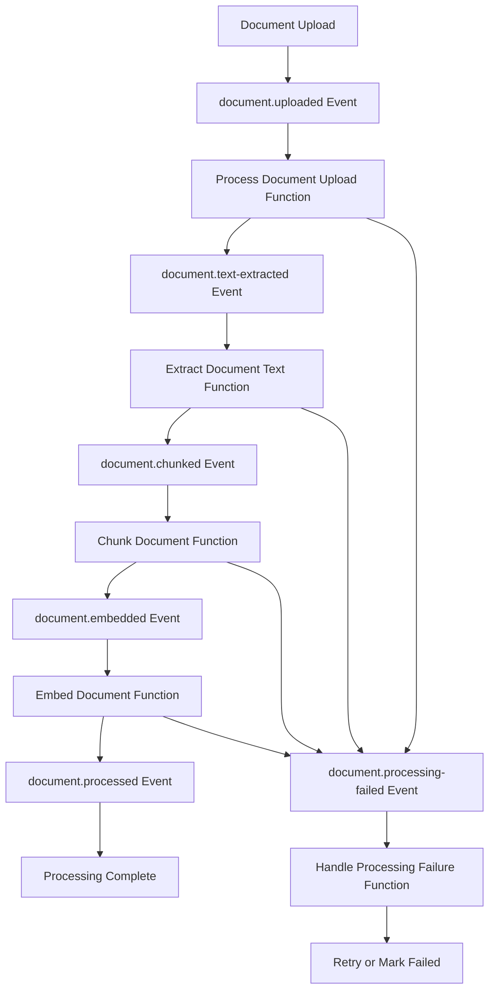

# Inngest Integration for RRA V2

This directory contains the Inngest integration for the RRA V2 document processing pipeline. Inngest provides durable execution, events, and queues for reliable document processing workflows.

## Overview

The Inngest integration handles the following document processing workflow:

1. **Document Upload** → Triggers the processing pipeline
2. **Text Extraction** → Extracts text from PDF/DOCX files  
3. **Document Chunking** → Splits text into semantic chunks
4. **Embedding Generation** → Creates vector embeddings for chunks
5. **Processing Complete** → Document ready for RAG queries

Each step is handled by a separate Inngest function that can retry independently, ensuring reliable processing even with temporary failures.

## Setup

### Local Development

1. **Install Inngest CLI** (optional but recommended):
   ```bash
   npm install -g inngest-cli
   ```

2. **Start Inngest Dev Server**:
   ```bash
   npx inngest-cli@latest dev
   ```
   This starts the local development server at `http://localhost:8288`

3. **Configure Environment Variables**:
   Copy `.env.test.example` to `.env.local` and configure Inngest settings:
   ```bash
   INNGEST_EVENT_KEY=local
   INNGEST_DEV_SERVER_URL=http://localhost:8288
   ```

4. **Start Your Application**:
   ```bash
   bun dev
   ```

5. **Register Functions**:
   Visit `http://localhost:3000/api/inngest` to register your functions with the dev server.

### Production Deployment

1. **Sign up for Inngest Cloud** at [inngest.com](https://inngest.com)

2. **Get your keys** from the Inngest dashboard:
   - Event Key
   - Signing Key

3. **Configure Production Environment**:
   ```bash
   INNGEST_EVENT_KEY=your-event-key
   INNGEST_SIGNING_KEY=your-signing-key
   ```

4. **Deploy and Register**:
   After deployment, Inngest will automatically discover and register your functions via the `/api/inngest` endpoint.

## Architecture

### File Structure

```
lib/inngest/
├── client.ts              # Inngest client configuration
├── types.ts               # TypeScript type definitions
├── utils.ts               # Utility functions
├── index.ts               # Main module exports
├── README.md              # This file
└── functions/             # Inngest function implementations
    ├── README.md          # Function documentation
    ├── process-document-upload.ts
    ├── extract-document-text.ts
    ├── chunk-document.ts
    ├── embed-document.ts
    └── handle-processing-failure.ts
```

### Event Flow



### Database Integration

The Inngest workflows integrate with the existing database schema:

- **Documents**: `ragDocument` table tracks processing status
- **Content**: `documentContent` table stores extracted text
- **Chunks**: `documentChunk` table stores text segments
- **Embeddings**: `documentEmbedding` table stores vector embeddings

Each function updates the document status as processing progresses.

## Event Types

All events are strongly typed using TypeScript. Key event types include:

- `DocumentUploadedPayload` - Triggered when a document is uploaded
- `DocumentTextExtractedPayload` - Triggered when text extraction completes
- `DocumentChunkedPayload` - Triggered when chunking completes
- `DocumentEmbeddedPayload` - Triggered when embedding generation completes
- `DocumentProcessingFailedPayload` - Triggered when any step fails

See `types.ts` for complete type definitions.

## Error Handling

The system includes comprehensive error handling:

- **Automatic Retries**: Failed functions retry with exponential backoff
- **Dead Letter Queue**: Permanently failed events are captured
- **Error Events**: Failures trigger specific error handling workflows
- **Status Tracking**: Document status is updated throughout the pipeline

## Monitoring

Inngest provides built-in monitoring:

- **Function Logs**: Detailed execution logs for each function run
- **Metrics**: Performance metrics and success rates
- **Alerting**: Configure alerts for failed functions
- **Replay**: Replay failed events after fixing issues

Access the monitoring dashboard at:
- Development: `http://localhost:8288`
- Production: Inngest Cloud dashboard

## Testing

Functions can be tested by:

1. **Unit Tests**: Test function logic with mocked events
2. **Integration Tests**: Send real events via the Inngest client
3. **Manual Testing**: Use the Inngest dashboard to trigger events

Example of sending a test event:

```typescript
import { inngest, EVENT_NAMES } from "@/lib/inngest";

await inngest.send({
  name: EVENT_NAMES.DOCUMENT_UPLOADED,
  data: {
    documentId: "test-doc-id",
    filename: "test.pdf",
    // ... other required fields
  },
});
```

## Configuration

All configuration is handled via environment variables. See `.env.test.example` for all available options:

- **Basic Configuration**: App ID, event keys, URLs
- **Timeouts**: Per-function timeout settings  
- **Concurrency**: Parallel execution limits
- **Logging**: Log levels and debugging options

## Next Steps

This infrastructure provides the foundation for the document processing workflow. The next agents should:

1. **Implement Functions**: Create the actual workflow functions in `lib/inngest/functions/`
2. **Integration**: Connect functions to existing document processing code
3. **Testing**: Add comprehensive tests for the workflow
4. **Monitoring**: Set up alerting and monitoring in production

For questions or issues, refer to the [Inngest documentation](https://www.inngest.com/docs) or the function-specific README files.